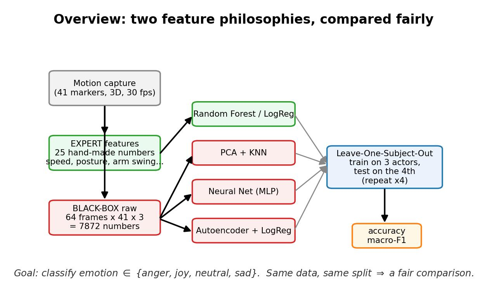
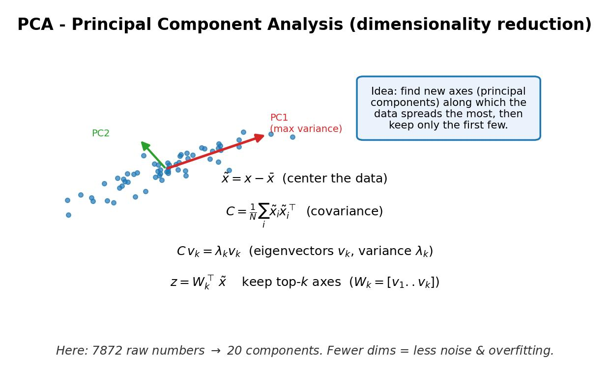
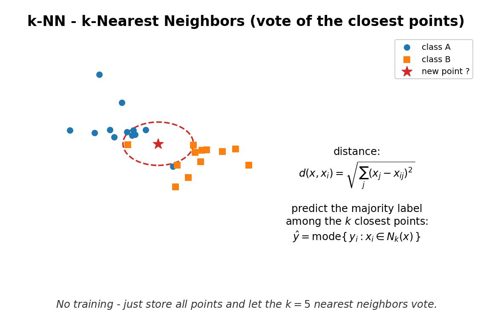
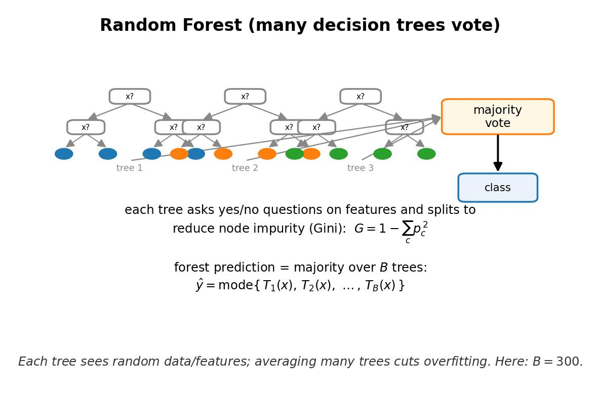
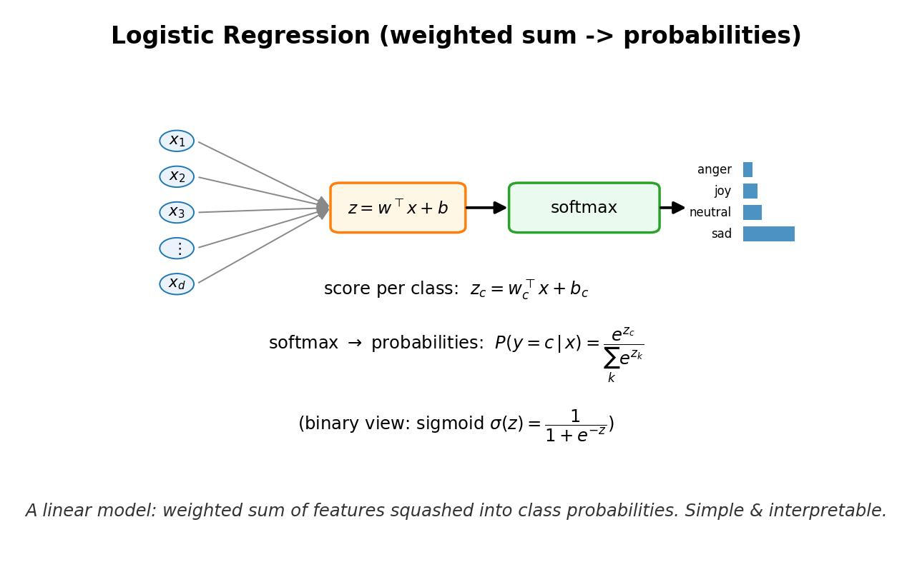
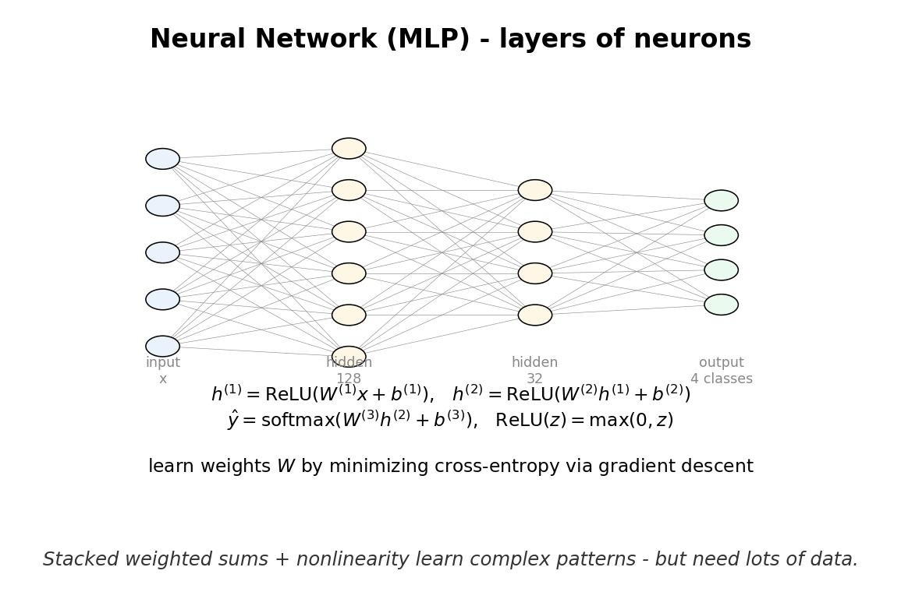
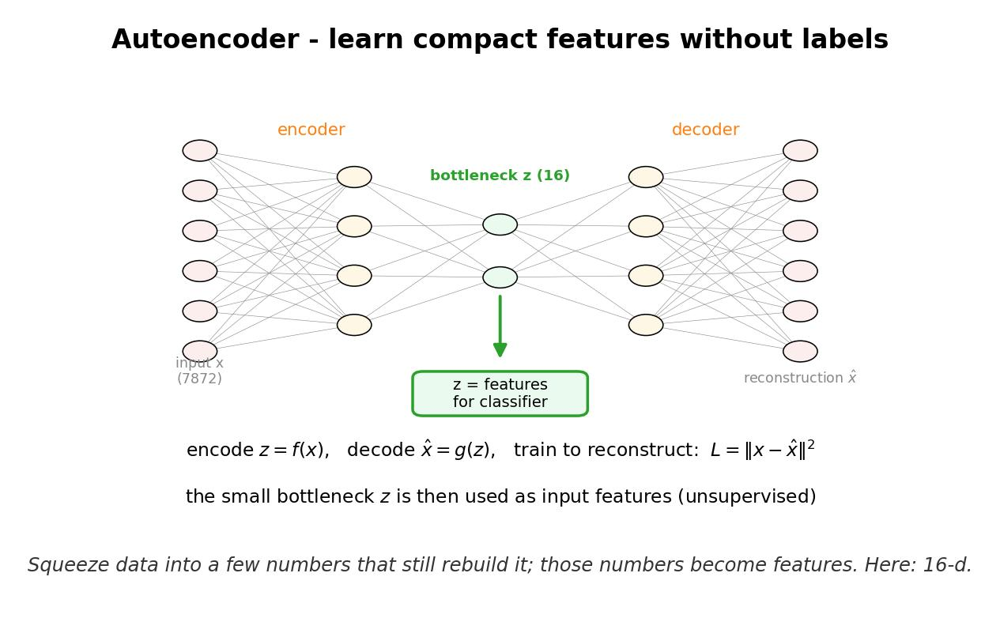

# Homework-2 — 表現的歩行からの感情分類（手法比較）

College de France の **expressive gait database**（モーションキャプチャ）を用いて、
歩行から表現された感情を分類する。**特徴量の作り方が異なる2つの哲学**（専門家による
手作り特徴 vs. 生データのブラックボックス）を、複数のモデルで比較する。

English version: [README_EN.md](README_EN.md)

> データ本体はコース配布物で再配布許諾が不明確なため**コミットしません**
> （約55MB）。`.gitignore` で `Homework-2/data/` を除外しています。各自でDLしてください。

---

## 1. 使用データ

- 入手元: 課題に記載の Dropbox 共有フォルダ（`data/expressive_gait/` に展開）。
- 中身: `MotionCaptureData trc/`（**今回使用**）、`JointAngleData anm_scaled/`、`anm_scaled/`、`A few videos/`。
- 使ったのは **TRC モーションキャプチャ**（`.trc`）: 41マーカーの3D座標、30fps。
- **81 試行** = 俳優4名（NABA / PAIB / SALE / EMLA）× 感情4種 × 約5試行。
- ラベルはファイル名のフランス語コードから取得:
  `COE=colère(anger)`, `JOE=joie(joy)`, `NEE=neutre(neutral)`, `TRE=triste(sad)`。
- クラスはほぼ均衡（anger 20 / joy 20 / neutral 21 / sad 20）。chance = 0.25。

軸: X=左右, **Y=鉛直**, Z=進行方向。

---

## 2. 2つの特徴量哲学

| | 専門家特徴 (Expert) | ブラックボックス (Raw) |
|---|---|---|
| 中身 | 歩行速度・ケイデンス・歩幅・体幹傾斜・頭の傾き・腕振り幅・肘/膝ROM・運動エネルギー/ジャーク など **25個の解釈可能なスカラー** | 各試行を64フレームに固定長リサンプルし、骨盤中心・身長で正規化した生マーカー座標を平坦化（**7872次元**） |
| 思想 | 感情歩行の知見を人手で埋め込む | 何も埋め込まず、モデルに構造を見つけさせる |
| 実装 | [src/expert_features.py](../src/expert_features.py) | [src/blackbox_prep.py](../src/blackbox_prep.py) |

---

## 3. 手法（5ラン）と比較設計

| Run | 特徴 | モデル |
|---|---|---|
| A | Expert | RandomForest |
| B | Expert | LogisticRegression |
| C | Raw → PCA(20) | KNN |
| D | Raw | MLP（ニューラルネット）|
| E | Raw → Autoencoder(16) | LogisticRegression |

課題が求める **2手法比較** を、5ランから3通り取り出す:

1. **専門家特徴 vs 純ブラックボックス** … A vs D
2. **PCA vs ニューラルネット** … C vs D
3. **手作り特徴 vs オートエンコーダ特徴** … B vs E
   （**下流の分類器を LogisticRegression に固定**し、特徴源だけを変えた公平比較）

### なぜこの比較を選んだか
- 比較1: 「専門知識を入れる/入れない」が性能にどう効くかを最も直接に見る対比。
- 比較2: 同じ生データに対し、**線形次元削減＋単純分類**と**非線形学習器**の対比。
- 比較3: 分類器を固定することで差を**特徴の良し悪しだけ**に帰属できる、最もクリーンな対照実験。

### アルゴリズム図解（初心者向け・数式入り）
各手法の仕組みを1枚にまとめた図（JPG・白背景・英語、[../src/make_figures.py](../src/make_figures.py) で生成）。

**全体像** — 2つの特徴哲学とLOSO評価の流れ



| 手法 | 図 |
|---|---|
| PCA（次元削減） |  |
| k-NN（近傍多数決） |  |
| Random Forest（決定木の多数決） |  |
| Logistic Regression（線形＋softmax） |  |
| Neural Net / MLP |  |
| Autoencoder（教師なし特徴学習） |  |

---

## 4. 評価: Leave-One-Subject-Out（LOSO）

俳優4名のうち1名を毎回テストに回す4分割交差検証。
テスト俳優は学習に一切現れないため、「**誰が歩いているか**」ではなく
「**どんな感情か**」を捉えているかを正しく測れる（被験者リークを防ぐ）。
スケーラ・PCA・AE は各 fold の学習データのみで fit。

---

## 5. 結果（LOSO）

| Method | accuracy | macro F1 |
|---|---|---|
| **A: Expert + RandomForest** | **0.91** | **0.92** |
| B: Expert + LogReg | 0.75 | 0.76 |
| C: PCA + KNN | 0.49 | 0.48 |
| D: Raw + MLP (NN) | 0.40 | 0.39 |
| E: Autoencoder + LogReg | 0.52 | 0.51 |

chance = 0.25。図は [outputs/](../outputs/) を参照
（`summary_scores.png`, `cm_*.png`, `expert_feature_importance.png`, `pca_scatter.png`）。

### 比較ごとの読み取り
1. **A(0.91) ≫ D(0.40)**: 試行が約60件と少ないため、生データのNNは高次元で過学習。
   人手の専門家特徴が圧勝。**小データでは専門知識が効く**。
2. **C(0.49) > D(0.40)**: 同じ生データでも、PCAで20次元に圧縮してからKNNの方が、
   7872次元をそのまま食わせるNNより堅牢。**次元の呪い**の実例。
3. **B(0.75) > E(0.52)**: 分類器を揃えても、手作り特徴がAE特徴を上回る。
   ただしAEは生データ直挿し(D)やPCA(C)より良く、**教師なしでも有用な表現**を学べている。

### 分かったこと
- 重要特徴（`expert_feature_importance.png`）は **運動エネルギー/ジャーク・体幹傾斜・肘ROM・腕振り**。
  これは感情歩行研究の定説（怒り/喜び＝速く大きく、悲しみ＝前傾・腕振り小）と一致。
- 混同行列で **sad はほぼ完全分離**、誤りは主に anger↔joy（どちらも高エネルギー）に集中。
- 教訓: **データが小さいほど、ドメイン知識による特徴設計の価値が大きい**。
  ブラックボックス/深層表現が専門家特徴を超えるには、より多くのデータが要る。

---

## 6. 実行方法

```bash
cd Homework-2
pip install -r requirements.txt
python3 src/main.py          # コンソールに表、outputs/ に図と results.json
```

各モジュールは単体実行で自己テスト可能:
`python3 src/data_loader.py` / `expert_features.py` / `blackbox_prep.py`。

## 7. ファイル構成
- [src/data_loader.py](../src/data_loader.py) … TRCパース・ラベル/被験者抽出
- [src/expert_features.py](../src/expert_features.py) … 専門家特徴25個
- [src/blackbox_prep.py](../src/blackbox_prep.py) … 生データ前処理
- [src/methods/](../src/methods/) … **手法ごとに1ファイル**（`run()` を公開）
  - [expert_rf.py](../src/methods/expert_rf.py) / [expert_logreg.py](../src/methods/expert_logreg.py) / [pca_knn.py](../src/methods/pca_knn.py) / [raw_mlp.py](../src/methods/raw_mlp.py) / [ae_logreg.py](../src/methods/ae_logreg.py)
- [src/main.py](../src/main.py) … 5手法 × LOSO評価・実験図表出力
- [src/make_figures.py](../src/make_figures.py) … アルゴリズム解説図(figs/)を生成
- [outputs/](../outputs/) … 実験結果の図・`results.json`
- [figs/](../figs/) … アルゴリズム解説図（JPG）
- [docs/](.) … README（JP/EN）
