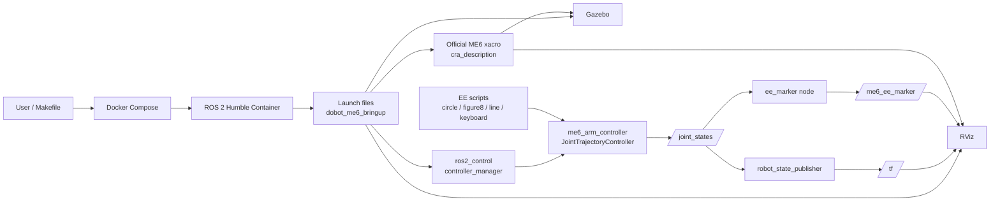
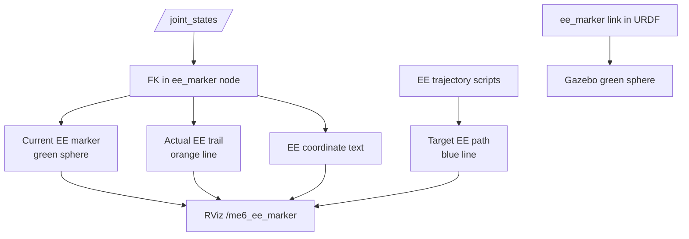

# Homework-3: DOBOT ME6 ROS 2 Docker Environment

This directory provides a Docker-based ROS 2 Humble workspace for DOBOT ME6/E6 visualization, MoveIt, Gazebo simulation, and hardware validation checks without touching a host machine that already has ROS 1 installed. The primary robot model comes from the official `Dobot-Arm/DOBOT_6Axis_ROS2_V4` ROS 2 SDK vendored in `ros2_ws/src/DOBOT_6Axis_ROS2_V4`.

## Directory Layout

`Homework-3` separates Docker configuration, the ROS 2 workspace, the official DOBOT SDK, and coursework launch/control scripts.

```text
Homework-3/
├── Makefile
├── compose.yaml
├── docker/
│   ├── Dockerfile
│   └── entrypoint.sh
├── README_JA.md
├── README_EN.md
├── UPSTREAM_DOBOT_6AXIS_ROS2_V4.md
└── ros2_ws/
    └── src/
        ├── DOBOT_6Axis_ROS2_V4/
        │   ├── cra_description/
        │   ├── dobot_rviz/
        │   ├── dobot_gazebo/
        │   ├── dobot_moveit/
        │   ├── me6_moveit/
        │   ├── cr_robot_ros2/
        │   └── dobot_msgs_v4/
        ├── dobot_me6_bringup/
        ├── dobot_me6_driver/
        └── dobot_me6_examples/
```

| Path | Description |
| --- | --- |
| `Makefile` | Entry point for Docker build, workspace build, RViz/Gazebo/MoveIt, and hardware checks |
| `compose.yaml` | Docker Compose settings for GUI display, host networking, and hardware connection environment variables |
| `docker/Dockerfile` | Docker image definition with ROS 2 Humble, Gazebo, MoveIt, ros2_control, and build dependencies |
| `docker/entrypoint.sh` | Entrypoint that automatically sources ROS 2 and workspace setup scripts |
| `UPSTREAM_DOBOT_6AXIS_ROS2_V4.md` | Official SDK URL, imported commit, and vendoring policy |
| `ros2_ws/src/DOBOT_6Axis_ROS2_V4/cra_description` | Official ME6 URDF/xacro and STL meshes. The `ee_marker` link is also defined here |
| `ros2_ws/src/DOBOT_6Axis_ROS2_V4/dobot_rviz` | Official RViz settings and display URDF. The EE marker display is also added here |
| `ros2_ws/src/DOBOT_6Axis_ROS2_V4/dobot_gazebo` | Official Gazebo launch/world files |
| `ros2_ws/src/DOBOT_6Axis_ROS2_V4/me6_moveit` | Official ME6 MoveIt configuration |
| `ros2_ws/src/DOBOT_6Axis_ROS2_V4/cr_robot_ros2` | Official TCP bringup node |
| `ros2_ws/src/DOBOT_6Axis_ROS2_V4/dobot_msgs_v4` | Message/service definitions used by the official bringup |
| `ros2_ws/src/dobot_me6_bringup` | `fake_control`, `gazebo`, `display` launch files and controller config for the official ME6 model |
| `ros2_ws/src/dobot_me6_driver` | Hardware pre-check and dry-run trajectory bridge |
| `ros2_ws/src/dobot_me6_examples` | EE circle, figure-eight, line, keyboard teleoperation, and EE marker publisher |

## System Architecture

Simulation, visualization, and control scripts are connected as follows.



`make fake` uses `fake_components/GenericSystem`, so no physical robot moves. `make sim-rviz` uses Gazebo's `gazebo_ros2_control/GazeboSystem` and RViz at the same time, observing the same `/joint_states` and `/tf`.

## EE Position Control

The EE trajectory scripts for this homework use the six ME6 joints while restricting the task to 3D end-effector position. The primary task is therefore 3DoF, while the robot has 6DoF, leaving 3DoF of redundancy for posture or expressive motion.

```text
redundancy = joint DoF - task DoF = 6 - 3 = 3
```

### Kinematics

Let `q ∈ R^6` be the joint vector and `x ∈ R^3` be the EE position. Forward kinematics is:

```text
x = f(q)
```

For small displacements, the position Jacobian `Jp(q) ∈ R^(3×6)` gives:

```text
dx = Jp(q) dq
```

### Damped Least Squares IK

Let `xd` be the target EE position, `x` the current EE position, and `e = xd - x` the position error. `ee_control_common.py` uses damped least squares for better numerical behavior near singular configurations.

```text
dq_task = Jp(q)^T (Jp(q) Jp(q)^T + λ^2 I)^(-1) Kp e
```

- `Kp`: position error gain
- `λ`: damping coefficient
- `dq_task`: small joint update for the next control cycle

The next joint vector is clamped to the joint limits.

```text
q_next = clamp(q + dq_task, q_min, q_max)
```

### Trajectory Generation

The circle, figure-eight, and reciprocating line scripts generate target positions `xd(t)` around the initial EE position `xc`.

Circle:

```text
xd(t) = xc + [r cos(ωt), r sin(ωt), 0]^T
```

Figure-eight:

```text
xd(t) = xc + [a sin(ωt), b sin(ωt) cos(ωt), 0]^T
```

Reciprocating line:

```text
xd(t) = xc + [A sin(ωt), 0, 0]^T
```

`--plane` and `--axis` assign these displacements to `xy`, `xz`, `yz`, `x`, `y`, or `z` directions.

### Keyboard Teleoperation

`ee_keyboard` maps key input to small increments of the EE target position.

```text
xd_next = xd + Δx_key
```

It then computes `q_next` with the same damped least squares IK and publishes a short `JointTrajectory` to `/me6_arm_controller/joint_trajectory`. It does not wait for an action result, which prevents old repeated key inputs from accumulating and continuing after the key is released.

### Visualization

The EE position is shown through two mechanisms.



- Gazebo: the `ee_marker` link in the URDF appears as a green sphere
- RViz: the `/me6_ee_marker` `MarkerArray` shows the current position, actual trail, target path, and coordinate text
- Color coding: green=current EE position / target start, orange=actual EE trail, blue=target EE path generated by the trajectory script, red=target end

## Runtime Environment

This workspace assumes the following environment.

| Item | Recommended/Used Version |
| --- | --- |
| Host OS | Verified on Ubuntu 22.04 LTS |
| Docker Engine | Docker Engine 20.10.17 or newer |
| Docker Compose | Docker Compose plugin v2.6.0 or newer |
| Container OS | Ubuntu 22.04 family |
| ROS 2 | Humble Hawksbill |
| Docker base image | `osrf/ros:humble-desktop` |
| Gazebo | Gazebo Classic provided by ROS 2 Humble apt packages |
| GUI | X11 |
| CPU/memory | x86_64, 8 GB RAM or more recommended |
| Disk space | 10 GB or more recommended for the Docker image and workspace |
| Hardware network | Wired LAN recommended, reachable from the host to the DOBOT ME6 |

Docker installation assumes the official Docker apt repository method on Ubuntu 22.04. The local setup was based on the Qiita article "Ubuntu 22.04にdockerをインストールする".

Check the host versions with:

```bash
docker --version
docker compose version
uname -m
lsb_release -a
```

Check ROS 2 inside the container with:

```bash
make shell
ros2 --version
printenv ROS_DISTRO
```

`printenv ROS_DISTRO` should return `humble`.

## Environment Setup

Docker and the Docker Compose plugin are required on the host. ROS 2 runs only inside the Docker container, so an existing host ROS 1 installation is fine. Linux/X11 is assumed for RViz and Gazebo.

### 1. Install Docker

On Ubuntu 22.04 without Docker, install Docker Engine and the Compose plugin from Docker's official apt repository.

```bash
sudo apt update
sudo apt install -y ca-certificates curl gnupg lsb-release
sudo mkdir -p /etc/apt/keyrings
curl -fsSL https://download.docker.com/linux/ubuntu/gpg | sudo gpg --dearmor -o /etc/apt/keyrings/docker.gpg
echo "deb [arch=$(dpkg --print-architecture) signed-by=/etc/apt/keyrings/docker.gpg] https://download.docker.com/linux/ubuntu $(lsb_release -cs) stable" | sudo tee /etc/apt/sources.list.d/docker.list > /dev/null
sudo apt update
sudo apt install -y docker-ce docker-ce-cli containerd.io docker-buildx-plugin docker-compose-plugin
```

After installation, confirm that the Docker daemon is running.

```bash
sudo systemctl status docker
sudo docker run hello-world
docker compose version
```

If `sudo docker run hello-world` succeeds, Docker itself is installed. Configure user permissions in the next step if you want to run `make build` and `make ws` without `sudo`.

### 2. Check Docker permissions

First confirm that the current user can access the Docker daemon.

```bash
docker ps
```

If you see `permission denied while trying to connect to the docker API`, add the current user to the `docker` group.

```bash
sudo usermod -aG docker $USER
```

Note: membership in the `docker` group effectively grants root-level control through the Docker daemon. Check the administration policy on shared machines.

Run this command only once. Do not put it in `.bashrc`. To apply the group change, log out of Ubuntu and log back in, or apply it to the current terminal with:

```bash
newgrp docker
docker ps
```

### 3. Enter Homework-3

Move to the `Homework-3` directory that contains this README. If your prompt is already in `~/Expressive_Robot_Control/Homework-3`, do not run `cd Homework-3` again.

```bash
cd ~/Expressive_Robot_Control/Homework-3
```

### 4. Allow GUI display

Allow local X11 connections so RViz and Gazebo can open windows from the Docker container.

```bash
xhost +local:docker
```

After the session, revoke the permission if desired.

```bash
xhost -local:docker
```

### 5. Build the Docker image

This creates the Docker image with ROS 2 Humble, Gazebo, MoveIt, ros2_control, and dependencies needed by the DOBOT official SDK.

```bash
make build
```

### 6. Build the ROS 2 workspace

This resolves dependencies with `rosdep` and builds the ME6-related packages with `colcon`.

```bash
make ws
```

To enter the built container and inspect the workspace manually:

```bash
make shell
source install/setup.bash
ros2 pkg list | grep -E 'dobot|me6|cra_description'
```

Note: the upstream `me6_moveit/package.xml` lists `warehouse_ros_mongo`, but ROS 2 Humble does not provide `ros-humble-warehouse-ros-mongo` through apt. `make ws` skips that rosdep key. It is not required for the normal RViz, Gazebo, or MoveIt demo flows.

## Make Command Reference

Run these commands from the `Homework-3` directory. For GUI commands, run `xhost +local:docker` first.

| Command | GUI | What it does | Main use |
| --- | --- | --- | --- |
| `make build` | No | Builds the Docker image | First setup, after Dockerfile changes |
| `make ws` | No | Runs `rosdep install` and `colcon build` | Resolve dependencies and build the ROS 2 workspace |
| `make shell` | No | Opens bash inside the ROS 2 Docker container | Run `ros2` / `colcon` commands manually |
| `make rviz` | RViz | Displays the official ME6 model in RViz | Check meshes, URDF, and TF |
| `make fake` | RViz | Starts the official ME6 model with fake `ros2_control` and RViz | Validate trajectory commands and EE trajectory scripts without hardware |
| `make sim` | Gazebo | Spawns the official ME6 model in Gazebo | Gazebo simulation check |
| `make sim-rviz` | Gazebo + RViz | Starts Gazebo and RViz together | Watch Gazebo motion and RViz state at the same time |
| `make moveit` | RViz/MoveIt | Starts the official SDK MoveIt demo | Manual planning and MoveIt config checks |
| `make real-check` | No | Runs the hardware pre-check utility | Check safety/communication before motion |
| `make real` | No | Starts the official SDK TCP bringup | Connect to the physical ME6 |
| `make clean` | No | Removes `ros2_ws/build`, `install`, and `log` | Reset build artifacts |

## CI

GitHub Actions checks the Docker/ROS 2 build for `Homework-3`. The workflow file is `.github/workflows/homework3-ros2-ci.yml`.

It runs on:

- pushes to `main`
- pull requests that change `Homework-3/**` or the workflow file
- manual runs from the GitHub Actions page

Checks:

- `docker compose build`
- `rosdep install`
- `colcon build` for the ME6-related ROS 2 packages
- Python syntax checks for launch/example files

## Visualize in RViz

This launches the official ME6 model in RViz.
RViz shows the EE position as a green sphere, trail, and coordinate text on `/me6_ee_marker`. Gazebo also shows a green sphere at the EE position.

```bash
make rviz
```

In another terminal:

```bash
cd Homework-3
make shell
source install/setup.bash
ros2 run dobot_me6_examples send_joint_goal --target ready
```

## Validate Trajectories with Fake Control

This starts the official SDK model from `cra_description/urdf/me6_robot.xacro` with the official STL meshes and a `ros2_control` fake hardware backend, so no physical robot moves.

```bash
make fake
```

In another terminal:

```bash
make shell
source install/setup.bash
ros2 run dobot_me6_examples send_joint_goal --target home
```

## EE Trajectory Scripts

With `me6_arm_controller` running through `make fake`, open another terminal and run the end-effector position trajectory scripts independently. Each script starts from the current posture and sends `FollowJointTrajectory` commands generated by a small differential IK controller for the position task. In RViz, the target EE path generated by the script is shown as a blue line, while the actual EE trail computed from FK is shown as an orange line.

```bash
make shell
source install/setup.bash
```

Circle:

```bash
ros2 run dobot_me6_examples ee_circle --duration 12 --radius 0.055 --plane xy
```

Figure-eight:

```bash
ros2 run dobot_me6_examples ee_figure8 --duration 12 --width 0.10 --height 0.055 --plane xy
```

Reciprocating line:

```bash
ros2 run dobot_me6_examples ee_line --duration 10 --length 0.12 --axis x
```

Keyboard teleoperation:

```bash
ros2 run dobot_me6_examples ee_keyboard
```

Key bindings are `w/s: +X/-X`, `a/d: +Y/-Y`, `r/f: +Z/-Z`, and `q: quit`. Use this in `make fake` first, not on hardware.

## Gazebo Simulation

This spawns the official ME6 model in Gazebo.

```bash
make sim
```

To launch Gazebo and RViz together:

```bash
make sim-rviz
```

MoveIt virtual demo:

```bash
make moveit
```

## Hardware Validation

Start with a communication-only check:

```bash
export DOBOT_ME6_IP=192.168.5.1
make real-check
```

The trajectory bridge defaults to dry-run mode.

```bash
make shell
source install/setup.bash
ros2 launch dobot_me6_driver real_validation.launch.py robot_ip:=$DOBOT_ME6_IP dry_run:=true
```

To use the official SDK TCP bringup:

```bash
make real
```

Only switch `dry_run` off after checking the emergency stop, workspace, speed limits, homing state, and manufacturer-side safety settings.

```bash
ros2 launch dobot_me6_driver real_validation.launch.py robot_ip:=$DOBOT_ME6_IP dry_run:=false speed_ratio:=10.0
```

From another terminal:

```bash
ros2 run dobot_me6_examples send_joint_goal --target ready --duration 5.0
```

Note: `dobot_me6_driver` uses a command skeleton based on common DOBOT CR/CRA Dashboard/Motion TCP APIs. If the ME6 firmware uses different command names, ports, units, or joint order, adapt `dobot_dashboard_client.py` to the official hardware manual before enabling motion.

## ROS 1 Isolation

The host ROS 1 installation is not used. ROS 2 environment variables, Python packages, and Gazebo packages stay inside the Docker image. The host only provides Docker, X11 display access, and network access to the robot.

## References

- Docker Docs: Install Docker Engine on Ubuntu: https://docs.docker.com/engine/install/ubuntu/
- Docker Docs: Linux post-installation steps for Docker Engine: https://docs.docker.com/engine/install/linux-postinstall/
- Qiita: Ubuntu 22.04にdockerをインストールする: https://qiita.com/yoshiyasu1111/items/17d9d928ceebb1f1d26d
