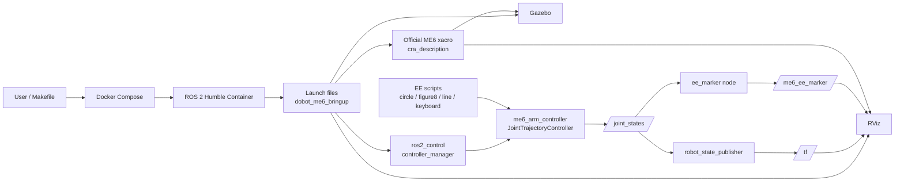
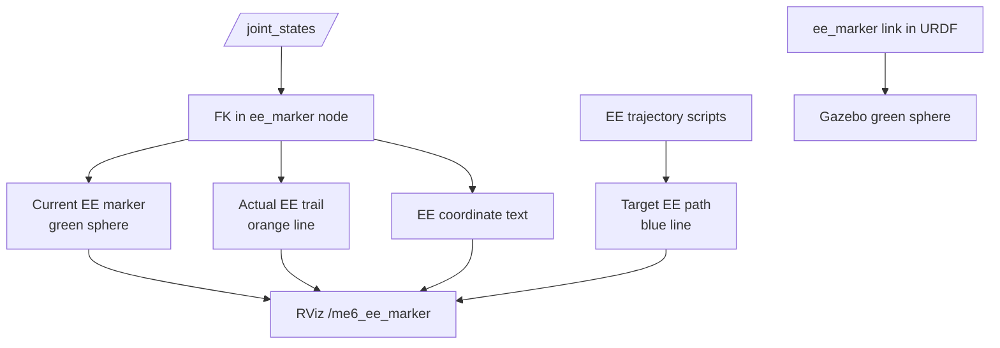

# Homework-3: DOBOT ME6 ROS 2 Docker 環境

このディレクトリは、ホスト側に ROS 1 が入っている環境でも、Docker 内で ROS 2 Humble を使って DOBOT ME6/E6 の表示、MoveIt、Gazebo シミュレーション、実機接続前チェックを行うための環境です。ロボットモデルは `Dobot-Arm/DOBOT_6Axis_ROS2_V4` の公式 ROS 2 SDK を `ros2_ws/src/DOBOT_6Axis_ROS2_V4` に取り込んで使用します。

## ディレクトリ構造

`Homework-3` は、Docker設定、ROS 2 workspace、公式DOBOT SDK、授業用の起動・制御スクリプトを分けて配置しています。

```text
Homework-3/
├── Makefile
├── compose.yaml
├── docker/
│   ├── Dockerfile
│   └── entrypoint.sh
├── README_JA.md
├── README_EN.md
├── UPSTREAM_DOBOT_6AXIS_ROS2_V4.md
└── ros2_ws/
    └── src/
        ├── DOBOT_6Axis_ROS2_V4/
        │   ├── cra_description/
        │   ├── dobot_rviz/
        │   ├── dobot_gazebo/
        │   ├── dobot_moveit/
        │   ├── me6_moveit/
        │   ├── cr_robot_ros2/
        │   └── dobot_msgs_v4/
        ├── dobot_me6_bringup/
        ├── dobot_me6_driver/
        └── dobot_me6_examples/
```

| パス | 内容 |
| --- | --- |
| `Makefile` | Docker build、workspace build、RViz/Gazebo/MoveIt/実機確認をまとめた入口 |
| `compose.yaml` | GUI表示、host network、実機接続用環境変数を含む Docker Compose 設定 |
| `docker/Dockerfile` | ROS 2 Humble、Gazebo、MoveIt、ros2_control、ビルド依存を入れるDocker image定義 |
| `docker/entrypoint.sh` | ROS 2 と workspace の setup script を自動sourceするentrypoint |
| `UPSTREAM_DOBOT_6AXIS_ROS2_V4.md` | 取り込んだ公式SDKのURL、commit、取り込み方針 |
| `ros2_ws/src/DOBOT_6Axis_ROS2_V4/cra_description` | 公式ME6 URDF/xacroとSTLメッシュ。`ee_marker` linkもここで定義 |
| `ros2_ws/src/DOBOT_6Axis_ROS2_V4/dobot_rviz` | 公式RViz設定と表示用URDF。EE marker displayも追加 |
| `ros2_ws/src/DOBOT_6Axis_ROS2_V4/dobot_gazebo` | 公式Gazebo launch/world |
| `ros2_ws/src/DOBOT_6Axis_ROS2_V4/me6_moveit` | 公式ME6 MoveIt設定 |
| `ros2_ws/src/DOBOT_6Axis_ROS2_V4/cr_robot_ros2` | 公式TCP bringupノード |
| `ros2_ws/src/DOBOT_6Axis_ROS2_V4/dobot_msgs_v4` | 公式bringupで使うmessage/service定義 |
| `ros2_ws/src/dobot_me6_bringup` | 公式ME6モデルを使う `fake_control`, `gazebo`, `display` launch と controller設定 |
| `ros2_ws/src/dobot_me6_driver` | 実機接続前チェックとdry-run軌道ブリッジ |
| `ros2_ws/src/dobot_me6_examples` | EE円軌道、8の字、直線、キーボード操縦、EE marker publisher |

## システム構成

シミュレーション・可視化・制御スクリプトは以下の流れで接続します。



`make fake` では `fake_components/GenericSystem` を使うため実機は動きません。`make sim-rviz` ではGazebo上の `gazebo_ros2_control/GazeboSystem` とRVizを同時に使い、同じ `/joint_states` と `/tf` を見ます。

## EE位置制御

この課題用のEE軌道スクリプトは、ME6の6関節を使い、タスクをEEの3次元位置に限定します。したがって主タスクは3DoF、ロボットは6DoFなので、姿勢や表現動作に使える冗長自由度は3DoFです。

```text
冗長自由度 = 関節自由度 - タスク自由度 = 6 - 3 = 3
```

### 運動学

関節角を `q ∈ R^6`、EE位置を `x ∈ R^3` とします。順運動学は以下です。

```text
x = f(q)
```

微小変位では、位置Jacobian `Jp(q) ∈ R^(3×6)` を使って以下の関係を使います。

```text
dx = Jp(q) dq
```

### Damped Least Squares IK

目標EE位置を `xd`、現在位置を `x`、位置誤差を `e = xd - x` とします。`ee_control_common.py` では、特異姿勢付近でも数値的に安定しやすいdamped least squaresを使っています。

```text
dq_task = Jp(q)^T (Jp(q) Jp(q)^T + λ^2 I)^(-1) Kp e
```

- `Kp`: 位置誤差ゲイン
- `λ`: damping係数
- `dq_task`: 次の制御周期で加える関節角の微小更新

更新後の関節角は、各関節の制限内にclampします。

```text
q_next = clamp(q + dq_task, q_min, q_max)
```

### 軌道生成

円、8の字、直線往復の各スクリプトは、開始時のEE位置 `xc` を中心として目標位置 `xd(t)` を生成します。

円軌道:

```text
xd(t) = xc + [r cos(ωt), r sin(ωt), 0]^T
```

8の字軌道:

```text
xd(t) = xc + [a sin(ωt), b sin(ωt) cos(ωt), 0]^T
```

直線往復:

```text
xd(t) = xc + [A sin(ωt), 0, 0]^T
```

`--plane` や `--axis` によって、これらの変位を `xy`, `xz`, `yz`, `x`, `y`, `z` 方向へ割り当てます。

### キーボード操縦

`ee_keyboard` はキー入力をEE目標位置の小さな増分に変換します。

```text
xd_next = xd + Δx_key
```

その後、同じdamped least squares IKで `q_next` を計算し、`/me6_arm_controller/joint_trajectory` に短い `JointTrajectory` をpublishします。Action完了待ちはしないため、キー長押し後に古い入力が溜まって実行され続ける遅延を抑えています。

### 可視化

EE位置は2系統で表示します。



- Gazebo: URDF内の `ee_marker` link を緑色の球として表示
- RViz: `/me6_ee_marker` の `MarkerArray` で現在位置、実軌跡、目標軌道、座標テキストを表示
- 色分け: 緑=現在EE位置/目標軌道始点、オレンジ=実EE軌跡、青=軌道スクリプトが生成した目標EE軌道、赤=目標軌道終点

## 動作環境

この環境は以下の構成を想定しています。

| 項目 | 推奨/使用バージョン |
| --- | --- |
| ホスト OS | Ubuntu 22.04 LTS で確認 |
| Docker Engine | 20.10.17 以降 |
| Docker Compose | Docker Compose plugin v2.6.0 以降 |
| コンテナ OS | Ubuntu 22.04 系 |
| ROS 2 | Humble Hawksbill |
| Docker base image | `osrf/ros:humble-desktop` |
| Gazebo | ROS 2 Humble apt パッケージで提供される Gazebo Classic |
| GUI | X11 |
| CPU/メモリ | x86_64、8 GB RAM 以上推奨 |
| ディスク容量 | Docker image と workspace 用に 10 GB 以上推奨 |
| 実機接続 | DOBOT ME6 と同一ネットワークに接続できる有線 LAN 推奨 |

Docker の導入は Ubuntu 22.04 上で Docker 公式 apt repository を登録する方法を想定しています。手元環境では Qiita の「Ubuntu 22.04にdockerをインストールする」を参考にしました。

ホスト側のバージョン確認:

```bash
docker --version
docker compose version
uname -m
lsb_release -a
```

コンテナ内の ROS 2 確認:

```bash
make shell
ros2 --version
printenv ROS_DISTRO
```

`printenv ROS_DISTRO` が `humble` を返せば、このプロジェクトが想定する ROS 2 環境です。

## 環境構築

ホスト側には Docker と Docker Compose plugin が必要です。ROS 2 は Docker コンテナ内だけで使うため、ホスト側に ROS 1 が入っていても問題ありません。GUI を使う場合は X11 が使える Linux デスクトップを想定しています。

### 1. Docker をインストール

Docker 未導入の Ubuntu 22.04 では、Docker 公式 apt repository から Docker Engine と Compose plugin をインストールします。

```bash
sudo apt update
sudo apt install -y ca-certificates curl gnupg lsb-release
sudo mkdir -p /etc/apt/keyrings
curl -fsSL https://download.docker.com/linux/ubuntu/gpg | sudo gpg --dearmor -o /etc/apt/keyrings/docker.gpg
echo "deb [arch=$(dpkg --print-architecture) signed-by=/etc/apt/keyrings/docker.gpg] https://download.docker.com/linux/ubuntu $(lsb_release -cs) stable" | sudo tee /etc/apt/sources.list.d/docker.list > /dev/null
sudo apt update
sudo apt install -y docker-ce docker-ce-cli containerd.io docker-buildx-plugin docker-compose-plugin
```

インストール後、Docker daemon が起動していることを確認します。

```bash
sudo systemctl status docker
sudo docker run hello-world
docker compose version
```

`sudo docker run hello-world` が成功すれば Docker のインストール自体は完了です。以降の `make build` / `make ws` を `sudo` なしで実行したい場合は、次の手順でユーザ権限を設定します。

### 2. Docker の利用権限を確認

まず Docker daemon に現在のユーザで接続できるか確認します。

```bash
docker ps
```

`permission denied while trying to connect to the docker API` が出る場合は、現在のユーザを `docker` グループに追加します。

```bash
sudo usermod -aG docker $USER
```

注意: `docker` グループに入ったユーザは Docker daemon 経由で root 相当の操作が可能です。共用PCでは管理方針を確認してください。

このコマンドは一度だけ実行すれば十分です。`.bashrc` には書かないでください。グループ変更を反映するには、Ubuntu から一度ログアウトして再ログインするか、現在の端末だけ反映する場合は次を実行します。

```bash
newgrp docker
docker ps
```

### 3. Homework-3 に移動

この README がある `Homework-3` ディレクトリに移動します。すでに `~/Expressive_Robot_Control/Homework-3` にいる場合は、追加で `cd Homework-3` しないでください。

```bash
cd ~/Expressive_Robot_Control/Homework-3
```

### 4. GUI 表示を許可

RViz/Gazebo を Docker コンテナから表示するため、X11 のローカル接続を許可します。

```bash
xhost +local:docker
```

作業後に戻す場合は次を実行します。

```bash
xhost -local:docker
```

### 5. Docker イメージをビルド

ROS 2 Humble、Gazebo、MoveIt、ros2_control、DOBOT 公式 SDK のビルドに必要な依存関係を含む Docker イメージを作成します。

```bash
make build
```

### 6. ROS 2 ワークスペースをビルド

`rosdep` で依存関係を解決し、`colcon` で ME6 関連パッケージをビルドします。

```bash
make ws
```

ビルド済みコンテナに入って手動で確認したい場合は次を使います。

```bash
make shell
source install/setup.bash
ros2 pkg list | grep -E 'dobot|me6|cra_description'
```

注: 公式 `me6_moveit/package.xml` には `warehouse_ros_mongo` が含まれていますが、ROS 2 Humble の apt では `ros-humble-warehouse-ros-mongo` が提供されないため、`make ws` では rosdep 解決から除外しています。通常の RViz、Gazebo、MoveIt デモには不要です。

## Make コマンド一覧

`Homework-3` 直下で実行します。GUI を使うコマンドの前には `xhost +local:docker` を実行してください。

| コマンド | GUI | 内容 | 主な用途 |
| --- | --- | --- | --- |
| `make build` | なし | Docker image をビルド | 初回セットアップ、Dockerfile更新後 |
| `make ws` | なし | `rosdep install` と `colcon build` を実行 | ROS 2 workspace の依存解決・ビルド |
| `make shell` | なし | ROS 2 Docker コンテナ内の bash を開く | 手動で `ros2` / `colcon` コマンドを実行 |
| `make rviz` | RViz | 公式 ME6 モデルを RViz で表示 | メッシュ、URDF、TF の確認 |
| `make fake` | RViz | 公式 ME6 モデル + fake `ros2_control` + RViz を起動 | 実機なしで軌道送信・EE軌道スクリプトを検証 |
| `make sim` | Gazebo | 公式 ME6 モデルを Gazebo に spawn | Gazebo シミュレーション確認 |
| `make sim-rviz` | Gazebo + RViz | Gazebo と RViz を同時起動 | Gazebo上の動作とRViz上の状態を同時確認 |
| `make moveit` | RViz/MoveIt | 公式 SDK の MoveIt demo を起動 | 手動計画、MoveIt設定確認 |
| `make real-check` | なし | 実機接続前の安全・通信チェック用ノードを実行 | ロボットを動かす前の確認 |
| `make real` | なし | 公式 SDK の TCP bringup を起動 | ME6 実機接続 |
| `make clean` | なし | `ros2_ws/build`, `install`, `log` を削除 | ビルド成果物のリセット |

## CI

GitHub Actions で `Homework-3` のDocker/ROS 2ビルドチェックを行います。workflow は `.github/workflows/homework3-ros2-ci.yml` です。

実行タイミング:

- `main` への push
- `Homework-3/**` または workflow ファイルを変更する pull request
- GitHub Actions 画面からの手動実行

チェック内容:

- `docker compose build`
- `rosdep install`
- ME6関連ROS 2パッケージの `colcon build`
- launch/example Python ファイルの構文チェック

## RViz でモデルを確認

公式 ME6 モデルを RViz で表示します。
RViz上ではEE位置を緑色の球、軌跡、座標テキストとして `/me6_ee_marker` に表示します。Gazebo上でもEE位置に緑色の球を表示します。

```bash
make rviz
```

別端末でコンテナに入り、サンプル姿勢を送れます。

```bash
cd Homework-3
make shell
source install/setup.bash
ros2 run dobot_me6_examples send_joint_goal --target ready
```

## Fake control で軌道検証

実機を動かさず、公式 SDK の `cra_description/urdf/me6_robot.xacro` と公式 STL メッシュを使って、`joint_trajectory_controller` まで含めた ROS 2 側の軌道送信を確認します。

```bash
make fake
```

別端末:

```bash
make shell
source install/setup.bash
ros2 run dobot_me6_examples send_joint_goal --target home
```

## EE 軌道スクリプト

`make fake` で `me6_arm_controller` を起動した状態で、別端末からエンドエフェクタ位置軌道を個別に実行できます。各スクリプトは現在姿勢を起点に、位置タスク用の簡易差分IKで `FollowJointTrajectory` を送信します。RVizでは、実行したスクリプトの目標EE軌道を青線、実際にFKから計算したEE軌跡をオレンジ線で表示します。

```bash
make shell
source install/setup.bash
```

円軌道:

```bash
ros2 run dobot_me6_examples ee_circle --duration 12 --radius 0.055 --plane xy
```

8の字軌道:

```bash
ros2 run dobot_me6_examples ee_figure8 --duration 12 --width 0.10 --height 0.055 --plane xy
```

直線往復:

```bash
ros2 run dobot_me6_examples ee_line --duration 10 --length 0.12 --axis x
```

キーボード操縦:

```bash
ros2 run dobot_me6_examples ee_keyboard
```

キー割り当ては `w/s: +X/-X`, `a/d: +Y/-Y`, `r/f: +Z/-Z`, `q: quit` です。実機接続時は使わず、まず `make fake` で動作確認してください。

## Gazebo シミュレーション

公式 SDK の ME6 モデルを Gazebo に spawn します。

```bash
make sim
```

Gazebo と RViz を同時に起動する場合:

```bash
make sim-rviz
```

MoveIt の仮想デモは次で起動します。

```bash
make moveit
```

## 実機検証

まずロボットを動かさず通信だけ確認します。

```bash
export DOBOT_ME6_IP=192.168.5.1
make real-check
```

軌道ブリッジは初期状態では dry-run です。

```bash
make shell
source install/setup.bash
ros2 launch dobot_me6_driver real_validation.launch.py robot_ip:=$DOBOT_ME6_IP dry_run:=true
```

公式 SDK の TCP bringup を使う場合:

```bash
make real
```

実機へ送信する場合のみ `dry_run:=false` にします。非常停止、可動範囲、周囲の安全、速度制限、メーカー純正ソフトでの原点復帰を確認してから実行してください。

```bash
ros2 launch dobot_me6_driver real_validation.launch.py robot_ip:=$DOBOT_ME6_IP dry_run:=false speed_ratio:=10.0
```

別端末から:

```bash
ros2 run dobot_me6_examples send_joint_goal --target ready --duration 5.0
```

注意: `dobot_me6_driver` の TCP コマンドは DOBOT CR/CRA 系 Dashboard/Motion API の一般的な形式をベースにした雛形です。ME6 のファームウェアでコマンド名、ポート、単位、軸順が異なる場合は `dobot_dashboard_client.py` を実機マニュアルに合わせて修正してください。

## ROS 1 との分離

ホスト側の ROS 1 は使いません。ROS 2 の環境変数、Python パッケージ、Gazebo 関連パッケージは Docker イメージ内に閉じています。ホスト側で必要なのは Docker、GUI 表示用 X11、実機 LAN 接続だけです。

## 参考

- Docker Docs: Install Docker Engine on Ubuntu: https://docs.docker.com/engine/install/ubuntu/
- Docker Docs: Linux post-installation steps for Docker Engine: https://docs.docker.com/engine/install/linux-postinstall/
- Qiita: Ubuntu 22.04にdockerをインストールする: https://qiita.com/yoshiyasu1111/items/17d9d928ceebb1f1d26d
